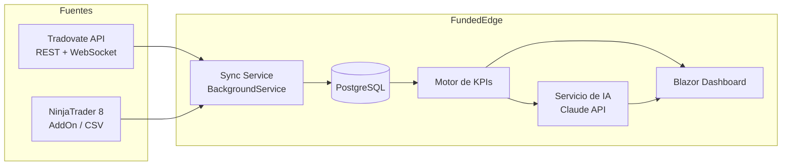
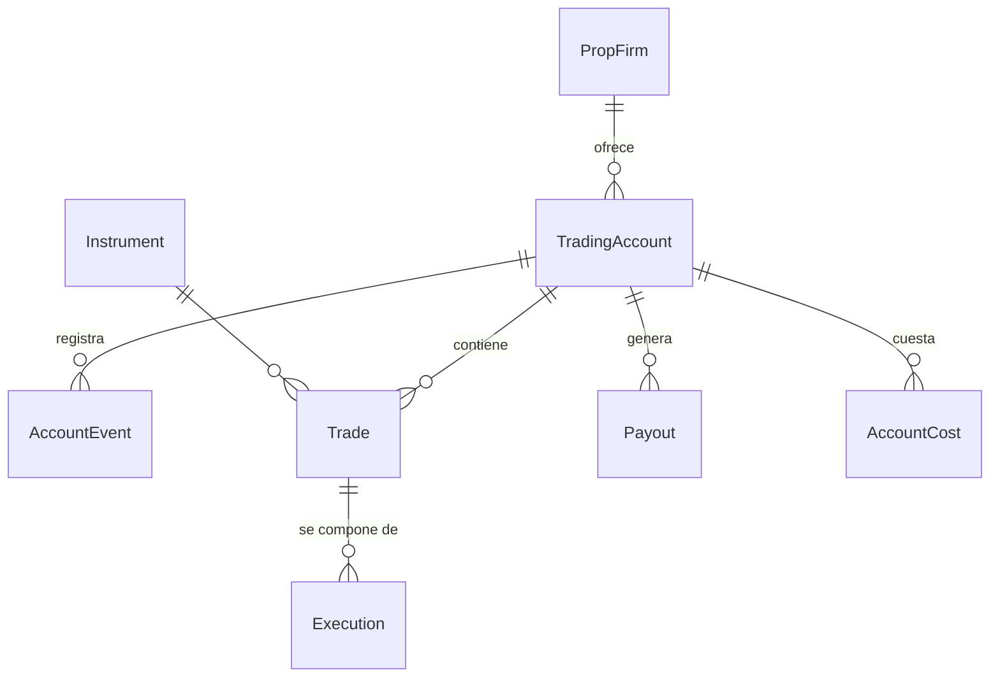

# FundedEdge — Guía de Implementación

> Aplicación en **.NET 10** para registrar y analizar cuentas de fondeo (prop firms de futuros), importar trades automáticamente desde **Tradovate** y **NinjaTrader 8**, y disponer de un dashboard de track record personal con análisis asistido por IA (Claude API).

---

## Índice

1. [Visión general y objetivos](#1-visión-general-y-objetivos)
2. [Stack tecnológico](#2-stack-tecnológico)
3. [Arquitectura de la solución](#3-arquitectura-de-la-solución)
4. [Modelo de dominio](#4-modelo-de-dominio)
5. [Integración con Tradovate API](#5-integración-con-tradovate-api)
6. [Integración con NinjaTrader 8](#6-integración-con-ninjatrader-8)
7. [Sincronización automática de trades](#7-sincronización-automática-de-trades)
8. [Dashboard y KPIs](#8-dashboard-y-kpis)
9. [Análisis con IA (Claude API)](#9-análisis-con-ia-claude-api)
10. [Módulo de riesgo: bankroll, riesgo de ruina y EV](#10-módulo-de-riesgo-bankroll-riesgo-de-ruina-y-ev)
11. [Seguridad y configuración](#11-seguridad-y-configuración)
12. [Roadmap por fases](#12-roadmap-por-fases)
13. [Testing](#13-testing)

---

## 1. Visión general y objetivos

### El problema

Operar cuentas de fondeo es un negocio de **riesgo asimétrico**: pagas una evaluación relativamente barata (50–500 €) a cambio de la posibilidad de gestionar capital y cobrar retiros mucho mayores. Para saber si el negocio es viable necesitas datos, no sensaciones:

- ¿Cuántas evaluaciones compro y cuántas paso?
- ¿Cuánto me cuesta de media llegar a una cuenta fondeada?
- ¿Cuánto retiro de media por cuenta fondeada antes de quemarla?
- ¿Es mi operativa estadísticamente rentable (esperanza matemática positiva)?
- ¿Tengo bankroll suficiente para sobrevivir a las rachas de pérdidas?

### Objetivos de la aplicación

| # | Objetivo | Módulo |
|---|----------|--------|
| 1 | Registrar cuentas compradas por empresa (Lucid Trading, Tradeify, Apex, extensible a otras) con su ciclo de vida completo | Cuentas |
| 2 | Registrar retiros (payouts) y costes (evaluaciones, activaciones, resets, cuotas mensuales) | Finanzas |
| 3 | Importar trades automáticamente vía API de Tradovate y desde NinjaTrader 8 | Integraciones |
| 4 | Dashboard de track record personal con KPIs de trading y de negocio | Dashboard |
| 5 | Análisis de la operativa con IA: patrones, fugas de dinero, sugerencias de mejora | IA |
| 6 | Cálculo de viabilidad estadística: esperanza, riesgo de ruina, Monte Carlo, bankroll mínimo | Riesgo |

---

## 2. Stack tecnológico

| Capa | Tecnología | Justificación |
|------|-----------|---------------|
| Runtime | **.NET 10 (LTS)** | Última LTS, soporte largo |
| Frontend | **Blazor Web App** (render interactivo *Server*) | Recomendado sobre MVC: dashboard con gráficos en tiempo real, componentes reutilizables, sin duplicar lógica en JS. MVC/Razor Pages es alternativa válida si prefieres páginas clásicas, pero un dashboard interactivo encaja mejor en Blazor |
| Gráficos | **ApexCharts.Blazor** o **Blazor-ApexCharts** (equity curve, distribuciones) | Librería madura, gratuita, buen soporte de series temporales |
| ORM | **EF Core 10** | Migraciones, LINQ |
| Base de datos | **PostgreSQL** (producción) / **SQLite** (desarrollo local) | Postgres para agregaciones de KPIs; SQLite permite arrancar sin infraestructura |
| Jobs en segundo plano | **BackgroundService** (`IHostedService`) o **Quartz.NET** si se necesitan crons complejos | Sincronización periódica de trades |
| IA | **SDK oficial de Anthropic para C#** (`Anthropic` en NuGet) | Análisis de la operativa con Claude |
| Autenticación | ASP.NET Core Identity (un solo usuario al inicio, pero deja la puerta abierta) | |
| Logs | Serilog + seq/console | Trazabilidad de los sync jobs |

> **Decisión Blazor vs MVC**: si en algún momento quieres exponer los datos a una app móvil o a terceros, añade un proyecto `FundedEdge.Api` (Minimal APIs) sobre la misma capa de aplicación. Blazor Server y la API comparten los mismos servicios.

---

## 3. Arquitectura de la solución

Arquitectura por capas ligera (no hace falta CQRS/DDD completo para un proyecto personal, pero sí separar integraciones):

```
FundedEdge.sln
├── src/
│   ├── FundedEdge.Domain/            # Entidades, enums, lógica de dominio pura
│   ├── FundedEdge.Application/       # Servicios de aplicación, cálculo de KPIs, interfaces (puertos)
│   ├── FundedEdge.Infrastructure/    # Implementaciones (adaptadores)
│   │   ├── Persistence/               #   EF Core, DbContext, migraciones, repositorios
│   │   ├── Integrations/
│   │   │   ├── Tradovate/             #   Cliente REST + WebSocket de Tradovate
│   │   │   └── NinjaTrader/           #   Receptor de ejecuciones + importador CSV
│   │   └── Ai/                        #   Cliente Claude, prompts, análisis
│   └── FundedEdge.Web/               # Blazor Web App (UI + endpoints internos)
└── tests/
    ├── FundedEdge.Domain.Tests/
    └── FundedEdge.Application.Tests/
```

Flujo de datos:



Principios:

- **El dominio no conoce las integraciones.** `FundedEdge.Application` define `ITradeSource`; Tradovate y NinjaTrader son dos implementaciones.
- **Idempotencia en la importación.** Cada trade importado guarda su `ExternalId` + `SourceType`; reimportar nunca duplica.
- **Los KPIs se calculan desde los datos crudos** (fills/trades), no se almacenan resultados que puedan quedar obsoletos — salvo snapshots diarios materializados por rendimiento.

---

## 4. Modelo de dominio

### Diagrama



### Entidades principales

```csharp
public class PropFirm
{
    public Guid Id { get; set; }
    public string Name { get; set; } = null!;          // "Lucid Trading", "Tradeify", "Apex Trader Funding"
    public string? Website { get; set; }
    public List<TradingAccount> Accounts { get; set; } = [];
}

public enum AccountStage
{
    Evaluation,      // Comprada, en fase de evaluación/challenge
    Funded,          // Evaluación superada, cuenta fondeada (PA/Live)
    Failed,          // Quemada (violó drawdown/regla) — terminal
    Withdrawn,       // Cerrada voluntariamente — terminal
    Expired          // Caducó sin completar
}

public enum DataFeedType { Tradovate, Rithmic, Other }

public class TradingAccount
{
    public Guid Id { get; set; }
    public Guid PropFirmId { get; set; }
    public string DisplayName { get; set; } = null!;    // "Apex 50K #3"
    public string? ExternalAccountId { get; set; }      // Id en Tradovate / nombre de cuenta en NT8
    public decimal AccountSize { get; set; }            // 50_000, 100_000...
    public decimal ProfitTarget { get; set; }
    public decimal MaxDrawdown { get; set; }
    public DrawdownType DrawdownType { get; set; }      // Trailing, EndOfDay, Static
    public AccountStage Stage { get; set; }
    public DataFeedType Feed { get; set; }              // Determina la vía de importación
    public DateOnly PurchasedOn { get; set; }
    public DateOnly? FundedOn { get; set; }
    public DateOnly? ClosedOn { get; set; }
    public List<AccountEvent> Events { get; set; } = [];
    public List<Trade> Trades { get; set; } = [];
    public List<Payout> Payouts { get; set; } = [];
    public List<AccountCost> Costs { get; set; } = [];
}

/// Historial de transiciones (auditable): compra, paso a fondeada, reset, fallo...
public class AccountEvent
{
    public Guid Id { get; set; }
    public Guid AccountId { get; set; }
    public AccountStage FromStage { get; set; }
    public AccountStage ToStage { get; set; }
    public DateTimeOffset OccurredAt { get; set; }
    public string? Notes { get; set; }
}

public enum CostKind { Evaluation, Activation, Reset, MonthlyFee, DataFee, Other }

public class AccountCost
{
    public Guid Id { get; set; }
    public Guid AccountId { get; set; }
    public CostKind Kind { get; set; }
    public decimal Amount { get; set; }
    public DateOnly PaidOn { get; set; }
}

public class Payout
{
    public Guid Id { get; set; }
    public Guid AccountId { get; set; }
    public decimal AmountRequested { get; set; }
    public decimal AmountReceived { get; set; }         // Tras split/comisiones de la firma
    public DateOnly RequestedOn { get; set; }
    public DateOnly? PaidOn { get; set; }
    public PayoutStatus Status { get; set; }            // Requested, Approved, Paid, Rejected
}
```

### Trades y ejecuciones

Un **trade** (round-turn) agrupa las ejecuciones (fills) de entrada y salida. Se almacenan ambas cosas: los fills crudos tal y como llegan de la fuente, y el trade agregado que usa el dashboard.

```csharp
public class Execution        // Fill crudo, inmutable
{
    public Guid Id { get; set; }
    public Guid AccountId { get; set; }
    public string ExternalId { get; set; } = null!;     // fillId de Tradovate / ExecutionId de NT8
    public TradeSourceType Source { get; set; }         // Tradovate, NinjaTraderAddOn, CsvImport
    public string Symbol { get; set; } = null!;         // "ESH6", "MNQZ5"...
    public OrderSide Side { get; set; }                 // Buy / Sell
    public int Quantity { get; set; }
    public decimal Price { get; set; }
    public DateTimeOffset ExecutedAt { get; set; }
    public decimal Commission { get; set; }
}

public class Trade            // Round-turn agregado (FIFO)
{
    public Guid Id { get; set; }
    public Guid AccountId { get; set; }
    public Guid InstrumentId { get; set; }
    public TradeDirection Direction { get; set; }       // Long / Short
    public int Quantity { get; set; }
    public decimal AvgEntryPrice { get; set; }
    public decimal AvgExitPrice { get; set; }
    public DateTimeOffset OpenedAt { get; set; }
    public DateTimeOffset ClosedAt { get; set; }
    public decimal GrossPnL { get; set; }
    public decimal Commissions { get; set; }
    public decimal NetPnL => GrossPnL - Commissions;
    public decimal? RiskedAmount { get; set; }          // Para R-múltiplos (manual u obtenido del stop)
    public decimal? RMultiple => RiskedAmount is > 0 ? NetPnL / RiskedAmount : null;
    public string? Tags { get; set; }                   // "news", "revenge", "setup-A"...
    public string? Notes { get; set; }
}

public class Instrument
{
    public Guid Id { get; set; }
    public string Root { get; set; } = null!;           // "ES", "NQ", "MNQ", "GC"
    public string Name { get; set; } = null!;
    public decimal TickSize { get; set; }               // ES: 0.25
    public decimal TickValue { get; set; }              // ES: 12.50 $
}
```

> **Reconstrucción de trades**: el `TradeBuilder` de `FundedEdge.Application` empareja fills por cuenta+símbolo con lógica FIFO de posición neta (posición pasa por 0 ⇒ trade cerrado). Cubre escalados de entrada/salida y flips (long→short en un fill: cierra un trade y abre otro).

### Nota sobre las tres empresas

| Firma | Plataforma/feed habitual | Vía de importación recomendada |
|-------|--------------------------|-------------------------------|
| **Tradeify** | Tradovate | **Tradovate API** directa |
| **Apex Trader Funding** | Rithmic o Tradovate (según cuenta) | Cuentas Tradovate → API directa. Cuentas Rithmic → **NinjaTrader 8** conectado a Rithmic + AddOn |
| **Lucid Trading** | Verificar el feed de cada cuenta | Igual: si expone Tradovate, API directa; si no, vía NinjaTrader 8 |

El campo `Feed` de `TradingAccount` decide qué conector usa el sync. **Verifica el feed real de cada cuenta al darla de alta** — las prop firms cambian de proveedor con frecuencia.

---

## 5. Integración con Tradovate API

### Requisitos previos

- Tradovate ofrece API REST + WebSocket. El **acceso API requiere una suscripción** (add-on "API Access" en tu cuenta Tradovate) y dar de alta una *API Key* (obtienes `cid` y `sec`). Verifica precios y condiciones actuales en su portal.
- URLs base (verificar en la documentación oficial, pueden cambiar):
  - Demo: `https://demo.tradovateapi.com/v1`
  - Live: `https://live.tradovateapi.com/v1`
  - WebSocket market/user data: `wss://md.tradovateapi.com/v1/websocket`

### Autenticación

```
POST /auth/accesstokenrequest
{
  "name": "usuario",
  "password": "contraseña",
  "appId": "FundedEdge",
  "appVersion": "1.0",
  "cid": <int>,       // de tu API key
  "sec": "<secret>",
  "deviceId": "<guid estable por instalación>"
}
→ { "accessToken": "...", "expirationTime": "...", ... }
```

El token caduca (≈80 min); renovar con `GET /auth/renewaccesstoken` antes de expirar. Implementar en un `TradovateAuthHandler` (DelegatingHandler) que cachea y renueva el token de forma transparente.

### Endpoints relevantes para el sync

| Endpoint | Uso |
|----------|-----|
| `GET /account/list` | Descubrir cuentas y mapearlas a `TradingAccount.ExternalAccountId` |
| `GET /fill/list` / `GET /fill/ldeps?masterids=<accountId>` | **Fills** — la fuente principal de trades |
| `GET /order/list` | Contexto de órdenes (stops → `RiskedAmount`) |
| `GET /cashBalance/getcashbalancesnapshot` | Balance actual (validar drawdown) |
| `GET /contract/item?id=` | Resolver `contractId` → símbolo |

### Esqueleto del cliente

```csharp
public interface ITradovateClient
{
    Task<IReadOnlyList<TradovateAccount>> GetAccountsAsync(CancellationToken ct);
    Task<IReadOnlyList<TradovateFill>> GetFillsAsync(long accountId, DateTimeOffset since, CancellationToken ct);
}

// Registro en DI
services.AddHttpClient<ITradovateClient, TradovateClient>(c =>
        c.BaseAddress = new Uri(cfg["Tradovate:BaseUrl"]!))
    .AddHttpMessageHandler<TradovateAuthHandler>()   // token + renovación
    .AddStandardResilienceHandler();                 // retries/backoff (Microsoft.Extensions.Http.Resilience)
```

Consideraciones:

- **Rate limiting**: Tradovate aplica límites por endpoint (respuestas `p-ticket`/`p-time` en el error). El handler de resiliencia debe respetar el tiempo de penalización indicado.
- **Multi-cuenta**: con varias cuentas de fondeo bajo el mismo login de Tradovate, `account/list` las devuelve todas; el mapeo a `TradingAccount` se hace por `ExternalAccountId`.
- **WebSocket (fase 2)**: para trades en tiempo real, suscripción `user/syncrequest` sobre el WebSocket, que empuja fills al instante. Para el MVP basta polling REST cada 5–15 min.

---

## 6. Integración con NinjaTrader 8

NinjaTrader 8 **no tiene API REST en la nube**: es una aplicación de escritorio. Hay tres vías, de mejor a peor:

### Opción A (recomendada): AddOn NinjaScript que empuja ejecuciones

Un AddOn en C# dentro de NT8 que se suscribe a las ejecuciones de todas las cuentas conectadas (Rithmic incluido) y las envía por HTTP a la API local de FundedEdge.

```csharp
// Dentro de NT8: Documents\NinjaTrader 8\bin\Custom\AddOns\FundedEdgeExporter.cs
public class FundedEdgeExporter : AddOnBase
{
    private HttpClient _http = null!;

    protected override void OnStateChange()
    {
        if (State == State.SetDefaults)
        {
            Name = "FundedEdge Exporter";
        }
        else if (State == State.Configure)
        {
            _http = new HttpClient { BaseAddress = new Uri("http://localhost:5210") };
            lock (Account.All)
                foreach (var account in Account.All)
                    account.ExecutionUpdate += OnExecutionUpdate;
        }
        else if (State == State.Terminated)
        {
            lock (Account.All)
                foreach (var account in Account.All)
                    account.ExecutionUpdate -= OnExecutionUpdate;
            _http?.Dispose();
        }
    }

    private void OnExecutionUpdate(object sender, ExecutionEventArgs e)
    {
        var payload = new
        {
            externalId  = e.Execution.ExecutionId,
            accountName = e.Execution.Account.Name,
            symbol      = e.Execution.Instrument.FullName,
            side        = e.Execution.MarketPosition.ToString(),   // Long/Short
            quantity    = e.Execution.Quantity,
            price       = e.Execution.Price,
            executedAt  = e.Execution.Time,
            commission  = e.Execution.Commission
        };
        // Fire-and-forget con reintento simple; la API es idempotente por externalId
        _ = _http.PostAsJsonAsync("/api/ingest/ninjatrader/executions", payload);
    }
}
```

En FundedEdge, un endpoint mínimo protegido por API key local:

```csharp
app.MapPost("/api/ingest/ninjatrader/executions",
    async (NtExecutionDto dto, IExecutionIngestService svc, CancellationToken ct) =>
    {
        await svc.IngestAsync(dto.ToExecution(), ct);   // Upsert por (Source, ExternalId)
        return Results.Accepted();
    })
   .RequireAuthorization("LocalIngest");
```

Ventajas: tiempo real, cubre **cualquier broker/feed conectado a NT8** (Rithmic para Apex/Lucid). Desventaja: NT8 debe estar abierto (ya lo está mientras operas).

> **Resiliencia**: si FundedEdge no está levantado cuando llega un fill, el AddOn debe encolar en disco (archivo JSONL local) y reintentar. Alternativa simple: además del push, un importador de respaldo (opción B) que reconcilia a fin de día.

### Opción B: importación de CSV (fallback y carga histórica)

NT8 → pestaña *Control Center → Trade Performance → (grid) → Export*. Un `CsvTradeImporter` en `Infrastructure/Integrations/NinjaTrader` parsea el CSV (culture-sensitive: NT8 exporta con la cultura del SO) y genera `Execution`/`Trade` con `Source = CsvImport`. Útil para:

- Cargar el histórico anterior a la instalación del AddOn.
- Reconciliar si el AddOn perdió eventos.

### Opción C: ATI/NTDirect

La interfaz ATI de NT8 (DLL `NtDirect`, archivos OIF) está pensada para *enviar* órdenes, no para leer histórico; no la uses para este caso.

---

## 7. Sincronización automática de trades

```csharp
public class TradeSyncService(
    IServiceScopeFactory scopeFactory,
    ILogger<TradeSyncService> logger) : BackgroundService
{
    protected override async Task ExecuteAsync(CancellationToken ct)
    {
        var timer = new PeriodicTimer(TimeSpan.FromMinutes(10));
        do
        {
            try
            {
                await using var scope = scopeFactory.CreateAsyncScope();
                var sync = scope.ServiceProvider.GetRequiredService<ITradeSyncOrchestrator>();
                await sync.SyncAllAccountsAsync(ct);
            }
            catch (Exception ex)
            {
                logger.LogError(ex, "Fallo en sincronización de trades");
            }
        } while (await timer.WaitForNextTickAsync(ct));
    }
}
```

`ITradeSyncOrchestrator` por cada cuenta activa:

1. Selecciona el conector según `TradingAccount.Feed` (Tradovate API / nada que hacer si es push de NT8).
2. Pide fills desde `MAX(ExecutedAt)` almacenado (con solape de 1h por seguridad).
3. Upsert idempotente de `Execution` por `(Source, ExternalId)`.
4. Ejecuta `TradeBuilder` para reagrupar los trades afectados.
5. Recalcula el snapshot diario (`DailyAccountStats`) de esa cuenta.
6. Emite un evento interno (`TradesUpdated`) que el dashboard Blazor escucha para refrescar en vivo.

---

## 8. Dashboard y KPIs

### 8.1 KPIs de trading (por cuenta, por firma y globales)

| KPI | Fórmula | Notas |
|-----|---------|-------|
| Net P&L | `Σ NetPnL` | Bruto − comisiones |
| Win rate | `wins / totalTrades` | |
| Profit factor | `Σ ganancias / |Σ pérdidas|` | > 1.5 sólido |
| Expectancy (esperanza) | `winRate·avgWin − lossRate·avgLoss` | En € y en R |
| Avg win / Avg loss (payoff ratio) | `avgWin / avgLoss` | |
| Max drawdown | Sobre equity curve de trades cerrados | Además del DD intradía de la firma |
| R-múltiplo medio | `avg(NetPnL / RiskedAmount)` | Requiere registrar riesgo por trade |
| Desviación estándar de PnL | `σ(NetPnL)` | Input del Monte Carlo |
| Sharpe / Sortino (diario) | `mean(dailyPnL)/σ(dailyPnL) · √252` | Orientativo en trading discrecional |
| Racha máx. de pérdidas | Conteo consecutivo | Input clave para bankroll |
| MAE / MFE | Excursión adversa/favorable máxima | Solo si la fuente da datos intratrade (fase 2) |
| Distribuciones | Por hora del día, día de la semana, instrumento, tag | Detección de fugas |

### 8.2 KPIs de negocio (lo específico de fondeo)

| KPI | Fórmula |
|-----|---------|
| Evaluaciones compradas / superadas | conteo por periodo y por firma |
| **Pass rate** | `evaluacionesSuperadas / evaluacionesTerminadas` |
| **Coste por cuenta fondeada** | `Σ costes / cuentasFondeadas` |
| Vida media de cuenta fondeada | `avg(ClosedOn − FundedOn)` |
| **Payout medio por cuenta fondeada** | `Σ AmountReceived / cuentasFondeadas` |
| **ROI del negocio** | `(Σ payouts − Σ costes) / Σ costes` |
| Cashflow neto mensual | `Σ payouts(mes) − Σ costes(mes)` |
| EV por evaluación comprada | ver [§10](#10-módulo-de-riesgo-bankroll-riesgo-de-ruina-y-ev) |

### 8.3 Estructura de páginas (Blazor)

```
/                      → Dashboard global: equity curve, cashflow, KPIs cabecera
/accounts              → Grid de cuentas con stage, DD restante, P&L
/accounts/{id}         → Detalle: trades, curva, reglas de la firma, eventos
/trades                → Journal filtrable (fecha, firma, instrumento, tag, R)
/payouts               → Retiros y costes; cashflow mensual
/analytics             → Distribuciones (hora/día/instrumento), rachas, R-múltiplos
/risk                  → Riesgo de ruina, Monte Carlo, bankroll planner
/ai                    → Informes de análisis IA + chat sobre tus datos
/settings              → Firmas, credenciales API, mapeo de cuentas
```

Los KPIs se sirven desde `IKpiService` con snapshots diarios materializados (`DailyAccountStats`) para que el dashboard cargue en milisegundos aunque haya decenas de miles de fills.

---

## 9. Análisis con IA (Claude API)

### 9.1 Enfoque

**No enviar los trades crudos "a ver qué dice la IA".** El valor está en combinar:

1. **Agregados estadísticos calculados por la app** (los KPIs de §8, distribuciones, rachas) — deterministas y fiables.
2. **Claude** para interpretar esos agregados, detectar patrones narrativos (overtrading tras pérdidas, degradación por horario, tamaño inconsistente) y proponer experimentos de mejora accionables.

Casos de uso:

- **Informe mensual/semanal**: resumen de la operativa, 3 fortalezas, 3 fugas, plan de acción.
- **Revisión de viabilidad**: dado el pass rate, costes y payouts, ¿el negocio es EV+? ¿Qué variable mover primero?
- **Chat sobre tus datos**: preguntas ad-hoc ("¿por qué pierdo los lunes?") con las estadísticas relevantes en contexto.

### 9.2 Setup

```bash
dotnet add src/FundedEdge.Infrastructure package Anthropic
```

La API key **nunca** en código: `ANTHROPIC_API_KEY` como variable de entorno o user-secrets (§11).

### 9.3 Servicio de análisis

```csharp
using Anthropic;
using Anthropic.Models.Messages;

public class ClaudeTradingAnalyst(AnthropicClient client) : ITradingAnalyst
{
    private const string SystemPrompt =
        """
        Eres un analista cuantitativo especializado en trading de futuros con cuentas
        de fondeo (prop firms). Recibirás estadísticas agregadas de la operativa de un
        trader. Tu trabajo:
        1. Diagnosticar fortalezas y fugas de dinero concretas, citando siempre la métrica.
        2. Evaluar la viabilidad estadística del negocio de fondeo (EV, riesgo de ruina).
        3. Proponer un plan de acción priorizado, con experimentos medibles.
        Sé directo y escéptico: si la muestra es pequeña, dilo; no inventes causas
        que los datos no soporten.
        """;

    public async Task<string> AnalyzeAsync(TradingStatsReport stats, CancellationToken ct)
    {
        var parameters = new MessageCreateParams
        {
            Model = Model.ClaudeOpus4_8,
            MaxTokens = 64000,
            Thinking = new ThinkingConfigAdaptive(),          // razonamiento adaptativo
            System = new List<TextBlockParam>
            {
                new()
                {
                    Text = SystemPrompt,
                    CacheControl = new CacheControlEphemeral() // prompt caching
                },
            },
            Messages =
            [
                new() { Role = Role.User, Content = stats.ToPromptJson() },
            ],
        };

        // Streaming: los informes son largos; evita timeouts y permite pintar en vivo
        var sb = new StringBuilder();
        await foreach (var ev in client.Messages.CreateStreaming(parameters)
                           .WithCancellation(ct))
        {
            if (ev.TryPickContentBlockDelta(out var delta) &&
                delta.Delta.TryPickText(out var text))
            {
                sb.Append(text.Text);
                // Opcional: empujar el delta al componente Blazor vía IProgress/canal
            }
        }
        return sb.ToString();
    }
}
```

`TradingStatsReport.ToPromptJson()` serializa un JSON compacto: KPIs globales, por firma, por instrumento, distribución horaria, últimas N rachas, y las métricas de negocio (§8.2) — típicamente < 10 KB, no miles de trades.

### 9.4 Salida estructurada (para pintar el informe en la UI)

Si quieres renderizar el análisis como tarjetas (diagnóstico / fugas / plan) en vez de texto libre, usa *structured outputs*:

```csharp
OutputConfig = new OutputConfig
{
    Format = new JsonOutputFormat
    {
        Schema = new Dictionary<string, JsonElement>
        {
            ["type"] = JsonSerializer.SerializeToElement("object"),
            ["properties"] = JsonSerializer.SerializeToElement(new
            {
                resumen = new { type = "string" },
                fortalezas = new { type = "array", items = new { type = "string" } },
                fugas = new { type = "array", items = new { type = "string" } },
                plan_accion = new { type = "array", items = new { type = "string" } },
                viabilidad = new { type = "string", @enum = new[] { "EV_POSITIVO", "EV_NEGATIVO", "MUESTRA_INSUFICIENTE" } }
            }),
            ["required"] = JsonSerializer.SerializeToElement(
                new[] { "resumen", "fortalezas", "fugas", "plan_accion", "viabilidad" }),
        },
    },
},
```

### 9.5 Buenas prácticas

- **Prompt caching**: el system prompt es estable → `CacheControl` en el último bloque de system. Los datos variables (stats del periodo) van en el mensaje de usuario, después del breakpoint de caché.
- **Coste**: un informe mensual son ~10 KB de entrada; con `claude-opus-4-8` ($5/$25 por MTok) el coste por informe es de céntimos. Programa el informe como job semanal, no en cada carga de página.
- **Persistencia**: guarda cada informe (`AiReport`: periodo, prompt-hash, respuesta, coste en tokens vía `response.Usage`) para consultar la evolución de los diagnósticos.
- **Honestidad estadística**: pasa siempre el tamaño de muestra a Claude y pide explícitamente que señale conclusiones no significativas (ya está en el system prompt).

---

## 10. Módulo de riesgo: bankroll, riesgo de ruina y EV

Este módulo responde a la pregunta central: **¿es estadísticamente viable mi negocio de cuentas de fondeo, y cuánto bankroll necesito?** Todo se implementa en `FundedEdge.Application` con datos reales del usuario (nada de supuestos genéricos).

### 10.1 Esperanza matemática del negocio (EV por evaluación)

El modelo del funnel de fondeo:

```
EV_por_evaluación = P(pasar) × EV_cuenta_fondeada − Coste_evaluación − P(pasar) × Coste_activación

EV_cuenta_fondeada = Σ payouts esperados antes de quemar la cuenta
                   ≈ payout_medio_por_cuenta_fondeada   (estimado con TUS datos históricos)
```

Con los KPIs de §8.2 la app calcula el EV real observado y su intervalo de confianza (bootstrap sobre las cuentas históricas). Reglas de visualización:

- `EV > 0` con muestra ≥ 20 evaluaciones terminadas → verde.
- `EV > 0` con muestra pequeña → ámbar ("prometedor, muestra insuficiente").
- `EV ≤ 0` → rojo, con desglose de qué variable lo arregla antes (↑pass rate vs ↑payout medio vs ↓coste).

### 10.2 Riesgo de ruina del bankroll

Aquí "ruina" = quedarte sin capital para comprar más evaluaciones antes de que el edge se materialice. Modelo de Monte Carlo (más honesto que fórmulas cerradas, porque el proceso no es i.i.d. simple):

```csharp
public record RuinSimulationInput(
    decimal Bankroll,               // Capital disponible para el negocio
    decimal EvaluationCost,         // Coste medio por evaluación (incl. resets prorrateados)
    decimal ActivationCost,
    double PassRate,                // De tus datos
    IReadOnlyList<decimal> HistoricalPayoutsPerFundedAccount, // Distribución empírica
    int MonthlyEvaluationBudget,    // Cuántas compras al mes como máximo
    int Months,
    int Iterations = 10_000);

public record RuinSimulationResult(
    double ProbabilityOfRuin,       // % de simulaciones que agotan bankroll
    decimal MedianFinalBankroll,
    decimal P5FinalBankroll,        // Percentil 5 (escenario malo)
    decimal P95FinalBankroll,
    int MedianMonthsToBreakeven);
```

El simulador muestrea el resultado de cada evaluación (Bernoulli con `PassRate`) y, si pasa, muestrea payouts de la **distribución empírica** del usuario (con reemplazo). Salidas en la página `/risk`:

- Curvas de abanico del bankroll (P5–P95) a 6/12/24 meses.
- **Probabilidad de ruina** dado el bankroll actual.
- **Bankroll mínimo recomendado** para P(ruina) < 5 % (búsqueda binaria sobre la simulación).
- Sensibilidad: sliders de pass rate y coste para ver el efecto en vivo (recalcular en el servidor, es barato).

### 10.3 Riesgo de ruina intra-cuenta (trailing drawdown)

Segunda simulación, por cuenta: dado tu `avgWin/avgLoss/winRate/σ` por trade y las reglas de la firma (drawdown trailing/EOD, profit target), Monte Carlo de la secuencia de trades para estimar:

- `P(pasar evaluación)` teórica con tu perfil actual (contrástala con tu pass rate real).
- `P(quemar cuenta fondeada antes del primer payout)`.
- Número esperado de trades hasta target o hasta ruina.

Esto revela cosas como "con tu volatilidad actual de PnL, el 40 % de las veces quemas la fondeada antes del primer retiro aunque tengas esperanza positiva" — el argumento cuantitativo para reducir tamaño.

### 10.4 Kelly y tamaño

Con EV y varianza estimados, mostrar la fracción de Kelly del bankroll dedicable a evaluaciones por mes (y recomendar ½ Kelly). Es orientativo: el objetivo es dar un marco, no una promesa.

> Los resultados de este módulo alimentan también el prompt de IA (§9): Claude recibe `ProbabilityOfRuin`, EV e intervalos, y los incorpora al diagnóstico.

---

## 11. Seguridad y configuración

- **Secretos** (`Tradovate:Cid`, `Tradovate:Sec`, credenciales, `ANTHROPIC_API_KEY`): user-secrets en desarrollo, variables de entorno o un vault en despliegue. Nunca en `appsettings.json` versionado.
- **Contraseña de Tradovate**: la API pide usuario/contraseña para el token. Almacénala cifrada con `IDataProtector` (ASP.NET Data Protection) si decides persistirla; alternativa: pedirla al arrancar el sync y mantener solo el token en memoria.
- El endpoint de ingesta de NT8 escucha **solo en localhost** y exige una API key local (el AddOn la lee de su configuración).
- La app es de un solo usuario al inicio, pero pon autenticación desde el día 1 si la despliegas fuera de `localhost` (contiene datos financieros).
- HTTPS obligatorio fuera de desarrollo.

`appsettings.json` (estructura, sin secretos):

```json
{
  "ConnectionStrings": { "Default": "Host=localhost;Database=trackrecord;..." },
  "Tradovate": {
    "BaseUrl": "https://live.tradovateapi.com/v1",
    "AppId": "FundedEdge",
    "AppVersion": "1.0"
  },
  "Sync": { "IntervalMinutes": 10, "OverlapMinutes": 60 },
  "Ai": { "Model": "claude-opus-4-8", "WeeklyReportCron": "0 8 * * 1" }
}
```

---

## 12. Roadmap por fases

### Fase 1 — MVP manual (1–2 semanas)
- [ ] Solución, proyectos, EF Core + SQLite, migración inicial.
- [ ] CRUD de firmas, cuentas, costes y payouts (Blazor).
- [ ] Ciclo de vida de cuenta con `AccountEvent`.
- [ ] Importador CSV de NinjaTrader (carga del histórico).
- [ ] `TradeBuilder` (fills → trades) con tests.
- [ ] Dashboard v1: equity curve, KPIs de trading básicos, KPIs de negocio (§8.2).

**Criterio de salida**: puedes ver tu ROI real del negocio de fondeo con datos históricos.

### Fase 2 — Automatización (2–3 semanas)
- [ ] Cliente Tradovate (auth + renovación, fills, cuentas) + `TradeSyncService`.
- [ ] AddOn NT8 con push de ejecuciones + cola local de reintento.
- [ ] Reconciliación CSV vs push (detección de huecos).
- [ ] PostgreSQL en despliegue + snapshots diarios materializados.
- [ ] Página `/analytics` con distribuciones.

**Criterio de salida**: los trades del día aparecen solos, sin tocar nada.

### Fase 3 — Riesgo e IA (2–3 semanas)
- [ ] Módulo de riesgo completo (§10): EV, Monte Carlo doble, bankroll planner.
- [ ] Integración Claude: informe semanal programado + página `/ai`.
- [ ] Salida estructurada + persistencia de informes.
- [ ] Chat sobre tus datos (contexto = stats agregadas del filtro activo).

### Fase 4 — Refinamiento
- [ ] WebSocket Tradovate en tiempo real.
- [ ] Alertas (proximidad a drawdown, elegibilidad de payout por reglas de cada firma).
- [ ] Etiquetado de trades asistido por IA (clasificar por setup/sesión).
- [ ] Export PDF del track record (para redes/inversores).

---

## 13. Testing

| Área | Enfoque |
|------|---------|
| `TradeBuilder` | **La pieza más crítica.** Tests unitarios exhaustivos: escalados, flips, fills fuera de orden, símbolos simultáneos, contratos con multiplicadores distintos |
| Cálculo de KPIs | Tests con datasets sintéticos de resultado conocido (p. ej. profit factor exacto) |
| Monte Carlo | Tests de propiedades: con `PassRate=1` y payouts positivos, `P(ruina)≈0`; con `EV<0` y horizonte largo, `P(ruina)→1`. Semilla fija para reproducibilidad |
| Cliente Tradovate | Tests de contrato con respuestas grabadas (WireMock.Net); renovación de token; manejo de rate limit |
| Ingesta NT8 | Test de idempotencia: mismo `ExternalId` dos veces ⇒ un solo registro |
| IA | Tests del serializador de stats (`ToPromptJson`) y del parseo de salida estructurada; el LLM en sí se prueba manualmente con informes de ejemplo |

---

## Apéndice A — Decisiones abiertas (revisar antes de la Fase 2)

1. **Feed real de cada firma**: confirmar cuenta por cuenta si Lucid/Apex exponen Tradovate o solo Rithmic (cambia la vía de importación).
2. **Coste del API Access de Tradovate**: verificar precio/condiciones vigentes y si compensa frente a operar solo vía AddOn NT8.
3. **`RiskedAmount` automático**: derivar el riesgo del stop inicial (orden OCO) desde `order/list` de Tradovate, o registrarlo manualmente en el journal.
4. **Despliegue**: local (Windows, junto a NT8) vs VPS. Si es VPS, el AddOn NT8 necesita apuntar a la URL remota con TLS + API key.

## Apéndice B — Referencias

- Documentación Tradovate API: https://api.tradovate.com
- NinjaTrader 8 NinjaScript (AddOns, `Account.ExecutionUpdate`): https://developer.ninjatrader.com
- SDK Anthropic C# (NuGet `Anthropic`) y Claude API: https://platform.claude.com/docs
- EF Core: https://learn.microsoft.com/ef/core
